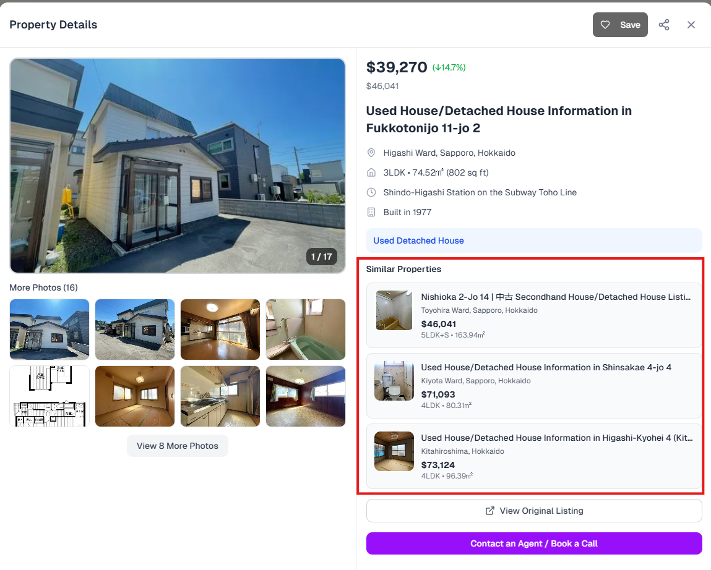
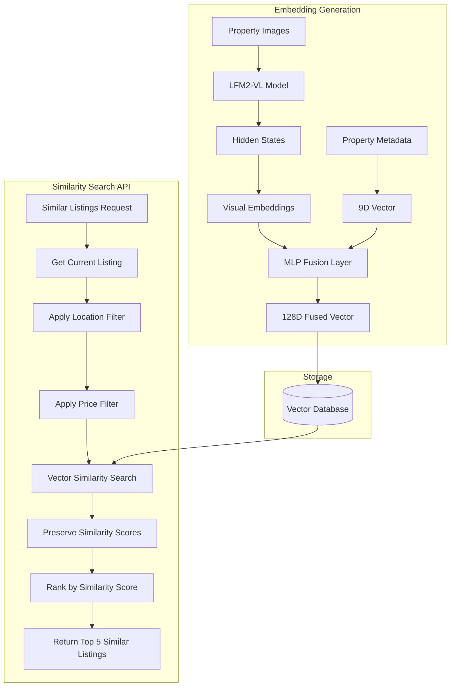

# Nippon Homes Real Estate Similarity System

> **Note**: This code represents a subset of a larger proprietary codebase. The components shown here focus specifically on the similarity search functionality and embedding generation service.

This document explains the multimodal similarity system for finding similar real estate listings using vector embeddings and machine learning, as implemented on [nipponhomes.com](https://nipponhomes.com).

## Overview

The system consists of two main components:
1. **Embedding Generation Service** - Creates multimodal embeddings from property images and metadata
2. **Similar Listings API** - Finds similar properties using vector similarity search with hybrid filtering

### Implementation Preview



## Components

### 1. Embedding Generation Service (`lfm2_hokkaido_embeddings.py`)

This service generates sophisticated multimodal embeddings for real estate listings by:

- **Image Processing**: Downloads and processes property images using LiquidAI's LFM2-VL-1.6B model, extracting hidden states as embeddings
- **Vector Fusion**: Combines visual embeddings with 9-dimensional property metadata (price, location, size, etc.) using a custom MLP (Multi-Layer Perceptron)
- **Storage**: Stores the resulting 128-dimensional fused vectors in a PostgreSQL vector database using the `vecs` extension

**Key Features:**
- Processes Hokkaido region listings specifically (due to time/computing constraint of the weekend)
- Handles up to 10 images per property
- Uses an MLP fusion layer to combine visual and structured data
- Batch processing with intelligent error handling
- Skip existing embeddings to avoid reprocessing

### 2. Similar Listings API (`route.ts`)

A Next.js API endpoint that finds similar properties using a hybrid search approach:

- **Vector Similarity**: Uses PostgreSQL's vector search capabilities to find listings with similar embeddings
- **Hybrid Filtering**: Applies location and price constraints before vector similarity ranking
- **Similarity Ranking**: Results are ranked by vector similarity scores (highest similarity first)

**Search Constraints:**
- Location: ±35km radius (±0.35 degrees lat/lng)
- Price: 50% to 200% of the target property's price
- Only active listings
- Results ordered by semantic similarity score

## System Architecture

### Technical Flow Diagram



## Data Flow

### Embedding Generation Process

1. **Listing Selection**: Fetch Hokkaido listings without existing embeddings
2. **Image Download**: Download up to 10 property images from CloudFront CDN
3. **Visual Processing**: Generate embeddings using LFM2-VL multimodal model by extracting hidden states
4. **Metadata Processing**: Extract 9D property vector (price, location, size, rooms, etc.)
5. **Fusion**: Combine visual and structured data through MLP network
6. **Storage**: Store 128D fused vectors in PostgreSQL with metadata

### Similarity Search Process

1. **Input Validation**: Validate listing ID and check for existing embeddings
2. **Current Listing**: Fetch source property's location and price data
3. **Candidate Filtering**: Filter by geographic proximity (±20km) and price range (50%-200%)
4. **Vector Search**: Query vector database for semantic similarity among filtered candidates
5. **Similarity Ranking**: Preserve and use similarity scores to rank results (most similar first)
6. **Result Assembly**: Fetch full listing details including images and English translations
7. **Response**: Return top 5 similar properties ranked by similarity score with complete metadata

## Technical Details

### Vector Dimensions
- **Visual Embeddings**: Variable dimension (depends on LFM2-VL hidden state output)
- **Property Metadata**: 9 dimensions (price, lat, lng, size, rooms, year, type, etc.)
- **Fused Output**: 128 dimensions (configurable)

### Database Tables
- `listings` - Main property data
- `images` - Property images with CloudFront URLs
- `listings_english` - AI-translated property descriptions
- `vecs.hokkaido_lfm2_fused_mlp` - Vector embeddings collection

### Performance Optimizations
- Batch processing for embedding generation
- Hybrid filtering to reduce search space
- Similarity score preservation and ranking

## Usage Examples

### Generate Embeddings
```bash
# Process 100 listings in batches of 10
python lfm2_hokkaido_embeddings.py --max-listings 100 --batch-size 10

# Process specific listing
python lfm2_hokkaido_embeddings.py --listing-id 77810038 --debug

# Process all listings (skip existing)
python lfm2_hokkaido_embeddings.py --max-listings 0 --skip-existing
```

### Actual Output
```
2025-09-14 06:11:53,952 - __main__ - INFO - Processing complete: 13340/13445 listings processed
2025-09-14 06:11:57,047 - __main__ - INFO - Created vector index for LFM2-VL embeddings
2025-09-14 06:11:57,047 - __main__ - INFO - Processing complete! Total time: 47308.39s
2025-09-14 06:11:57,048 - __main__ - INFO - Average time per listing embedding creation: 3.52s
```

### API Request
```bash
# Find similar listings
GET /api/listings/similar/[listingId]

# Example response
{
  "listings": [
    {
      "listingId": "12345",
      "title": "Modern Apartment in Sapporo",
      "price": 45000000,
      "location": "北海道札幌市中央区",
      "lat": 43.0642,
      "lng": 141.3469,
      "similarity": 0.87,
      "images": [...]
    }
  ],
  "count": 5
}
```

## Environment Requirements

- **Python**: 3.8+
- **GPU**: CUDA-compatible for optimal LFM2-VL performance
- **Database**: PostgreSQL with pgvector extension
- **Storage**: AWS S3 with CloudFront CDN
- **Dependencies**: PyTorch, Transformers, Supabase, vecs

The system provides intelligent property recommendations by understanding both visual aesthetics and structured property characteristics, enabling users to discover similar properties that match their preferences across multiple dimensions.